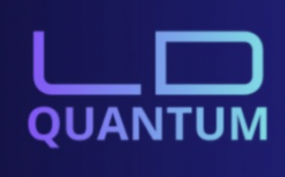

# INFORMACIÓN PROVISIONAL

# Presentaciones duales de 1º DAM (mañana) del curso 2025 / 2026

Listado con enlaces a los vídeos y normas para las exposiciones de alumnos duales de **1º DAM** (Desarrollo de Aplicaciones Multiplataforma) turno de mañana del **CPIFP Alan Turing** (Málaga - PTA) del curso 2025 - 2026.

## Índice

* [Horario y listado con enlaces al vídeo](#sec-horario)
  * [1DAM mañana](#1dam)
    
* [Duración del vídeo](#sec-tiempo)
* [Contenido de la presentación](#sec-contenido)
* [Formato y entrega del vídeo](#sec-formato)
* [Modalidad de la exposición](#sec-modalidad)

## Horario y listado con enlaces al vídeo

Cada alumno debe publicar en este repositorio un **enlace al vídeo** de su exposición, que cumpla los requisitos de [contenido](#sec-contenido), [duración del vídeo](#sec-tiempo) y [formato](#sec-formato). Puede añadir cualquier otra información que considere relevante (por ejemplo, notas o material de apoyo en el mismo repositorio).

### 1DAM

La **fecha límite** para publicar en la tabla el enlace a tu vídeo la indicará tu **tutor de la formación dual** (o el departamento) en clase o por los canales habituales del curso.

Cuando tengas el vídeo listo, **sustituye** en tu fila la palabra *pendiente* por el **enlace** (URL) al vídeo o a la lista de reproducción; debe abrirse al hacer clic.

| Alumno/a | Logo | Empresa | Enlace al vídeo |
| :-- | :--: | :-- | :-- |
| Álvarez Armijo, Marco |  | Oposiciones Camino | *pendiente* |
| Baena Urbaneja, Juan Manuel |  | Altaid | *pendiente* |
| Fernández Rodríguez, Juan Manuel |  | FixMe | *pendiente* |
| García Vela, Eliel Jesús |  | REWE | *pendiente* |
| Gutiérrez Castro, Jazmín |  | NTT Data | *pendiente* |
| Gutiérrez Fernández, Adrián |  | Accenture | *pendiente* |
| Luque Villanueva, Santiago |  | SweetCode | *pendiente* |
| Pagola Del Pino, Víctor |  | REWE | *pendiente* |
| Portillo Guerrero, Curro |  | SweetCode | *pendiente* |
| Rodríguez Espinosa, Sergio |  | SweetCode | *pendiente* |
| Ruiz Martín, Samuel |  | LD Quantum SL | *pendiente* |
| Sánchez Muñoz, Adrián |  | Diverxia | *pendiente* |
| Trujillo Rojas, Miguel |  | LD Quantum SL | *pendiente* |

*Alumnos sin exposición en vídeo este curso:* Arias García, Daniel; Jiménez Martín, María de la Paz; Lorenzo Bonilla, Jesús; Parra Moussaif, Ismael; Rodríguez Galiano, Juan Rolando; Sánchez Fernández, Ana Isabel.

## Duración del vídeo

Los límites de tiempo aplican al **vídeo** (o a la secuencia de vídeos enlazados, si se entrega en varias partes) de cada alumno o grupo en la misma empresa.

Los alumnos de la misma empresa deberán incluir en el vídeo una parte **común** sobre la empresa, de **5 minutos como máximo**. Si solo hay un alumno o alumna en la empresa, deberá incluir igualmente esa parte común. Después, cada uno incluirá una parte **individual** sobre su trabajo de **5 minutos como máximo**. Ahí termina la exposición grabada: **no** hay turno de preguntas ni cierre extra, porque la revisión la hace el profesorado **sin acto presencial**.

El material sobre la empresa (introducción, contexto) puede ser común para todos los alumnos que hayan realizado la formación dual en ella.

Ejemplo de temporización para el grupo de Luque, Portillo y Rodríguez Espinosa (empresa SweetCode):

* Hasta 5 minutos: parte común de SweetCode
* Hasta 5 minutos: parte individual de Santiago Luque Villanueva
* Hasta 5 minutos: parte individual de Curro Portillo Guerrero
* Hasta 5 minutos: parte individual de Sergio Rodríguez Espinosa

## Contenido de la presentación

El vídeo de la exposición debe incluir, como mínimo, el siguiente contenido:

* Introducción a la empresa. Se debe hacer en común cuando en la misma empresa hay varios alumnos.
* Tareas desempeñadas con temporalización por semanas.
* Herramientas utilizadas.
* Conocimientos adquiridos por cada módulo profesional.
* Valoración de la experiencia dual por parte del alumno.

## Formato y entrega del vídeo

La exposición se entrega como **vídeo** (un solo enlace o varios enlaces claros y ordenados, por ejemplo uno por bloque: empresa común, parte individual de cada alumno).

* El vídeo puede alojarse donde el alumno elija (por ejemplo plataforma educativa del centro, **YouTube** en lista no indexada o **Vimeo** con enlace privado), siempre que **el enlace sea accesible** para que el **profesorado** pueda visionarlo cuando revise la exposición.
* Se puede utilizar cualquier herramienta para grabar y editar (presentación en pantalla, cámara, voz en off, material multimedia, etc.).
* En el listado de este repositorio debe figurar tu **nombre** y el **enlace** al vídeo (o a la lista de reproducción).
* Cualquier material complementario (diapositivas exportadas, guion, anexos) puede enlazarse desde el mismo repositorio si el alumno lo considera útil; no sustituye al vídeo de la exposición.

## Modalidad de la exposición

Las exposiciones son **solo en vídeo**: cada alumno **sube el enlace** en la tabla de este repositorio. **No** hay asistencia presencial al centro para presentar ni **turno de preguntas** en directo.

El **profesorado** revisará los vídeos **de forma no presencial** (en su tiempo, fuera de cualquier sesión con el alumno vinculada a esta entrega), según los criterios y el calendario del departamento.

Si te ha resultado útil este repositorio, por favor marca el repositorio con una estrella en GitHub. ¡Gracias!

